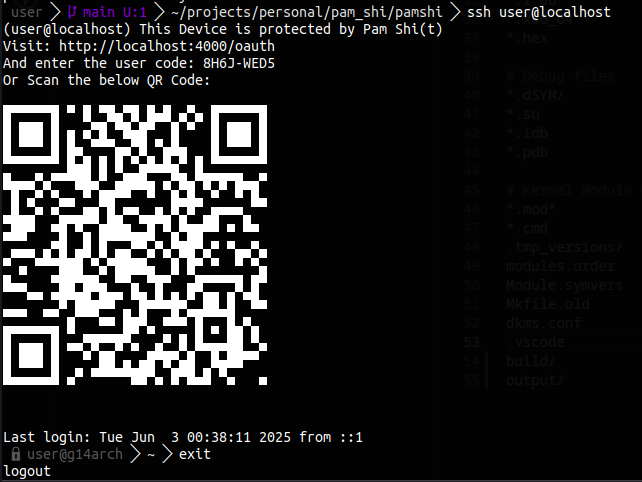

# pamshi - Linux PAM Module for OAuth 2.0 Device Authorization Grant ([RFC 8628](https://datatracker.ietf.org/doc/html/rfc8628))

> Built to be used with [delulufam - An IAM for Linux Instances](https://github.com/Utkar5hM/delulufam).
>
> NOTE: It's a repurposed project for now and so the name, it will be changed later someday.



Project Status: `WIP` (mvp)

## Usage Instruction

### Dependencies

Figure it out for now. As far as I remember, libcurl is required.

### Build & Install

The below command will install the PAM into the PAM installation directory `/lib64/security/`:

```sh
make install
```

You need to add the following line to your application's respective PAM configuration file:

```sh
# for sshd ( /etc/pam.d/sshd )
# for pamtester ( /etc/pam.d/pamtester )

auth sufficient pamshi.so debug user=root auth_server_url=http://localhost:4000
```

> In `user=username`, the username specifies the user with which the secrets file containing base32 encoded clientId will be opened. The file needs to have `0600` perm and owned by that user. 
>
> The secret is by default stored at `/etc/pamshi/.config`
>
> Debug is not necessary

### test

```sh
# test using pamtester with sshd service
make test
# or below command to test with pamtester service
make test TEST_SERVICE=pamtester
```

### cleanup
Run a cleanup before `make install` everytime to make sure it does build everytime.

```sh
make clean
```

### debugging
replace `service` with the service you will be using the PAM module with.
```sh
journalctl -f SYSLOG_IDENTIFIER="service(pamshi_auth)"
# ex- for sshd
journalctl -f SYSLOG_IDENTIFIER="sshd(pamshi_auth)"
```

------------


This project is heavily inspired (`blatantly copied several functions`) from [google-authenticator-libpam)](https://github.com/google/google-authenticator-libpam). Therefore, it can be used as an example on how to configure this PAM Module for a while.